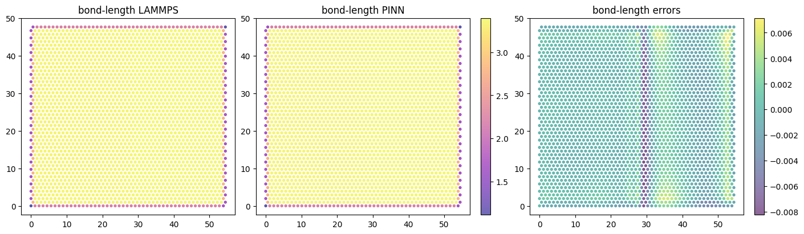
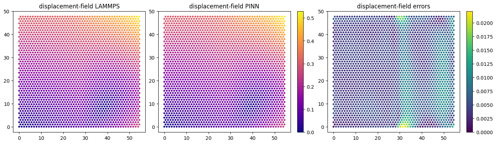
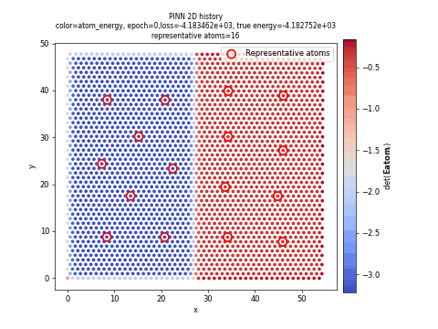
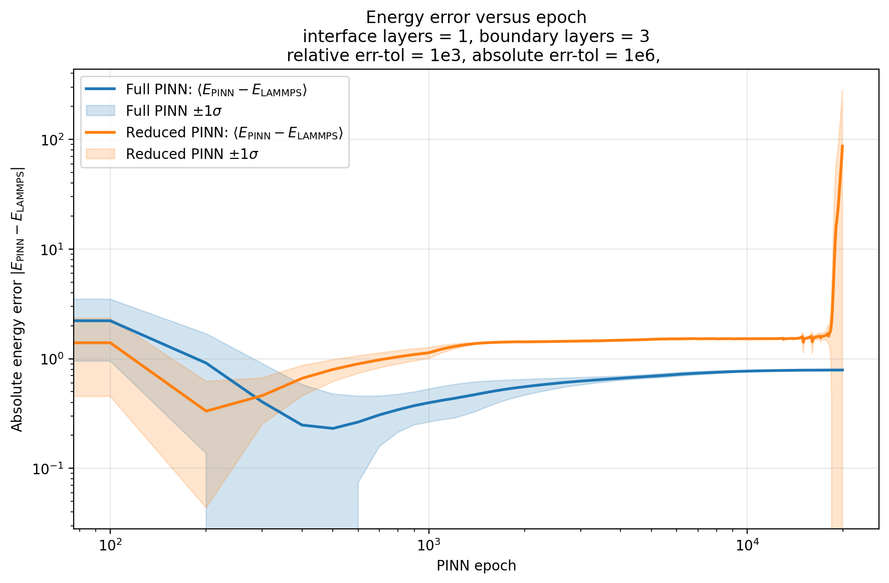
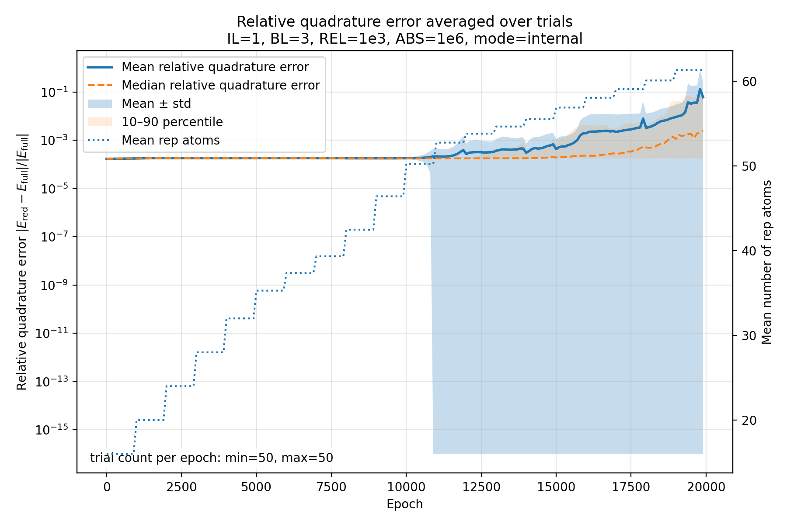

# Simulation Error Analysis & Performance Metrics

> **Simulation Configuration:**
> * `relative-error-tolerance` = `1e-3`
> * `absolute-error-tolerance` = `1e-6`

---

## 1. Structural Metric Errors (REDUCED vs. LAMMPS)

### Bond-Length Error

### Displacement-Field Error

---

## 2. Neural Network Accuracy (REDUCED vs. LAMMPS)

### Per-Atom Energy Difference
Comparison of the per-atom energy predicted by the `REDUCED` model against the baseline prediction from `LAMMPS`.

---

## 3. Comparative Analysis (REDUCED vs. FULL Simulation)

### Per-Atom Energy
| REDUCED System | FULL Simulation |
| :---: | :---: |
|  |  |

### Deformation Gradient Magnitude ($|F_i - I|$)
| REDUCED System | FULL Simulation |
| :---: | :---: |
|  |  |

### Deformation Gradient Discontinuity ($|F_i - F_j|$)
| REDUCED System | FULL Simulation |
| :---: | :---: |
|  |  |

---

## 4. Multi-Trial Aggregated Performance (Averaged Over 50 Trials)

### Energy Error vs. Epoch
Tracks both the `loss_energy - lammps_energy` and `true_energy - lammps_energy` profiles of the system.

### Growth of Error & Reclustering Triggers
This accumulated metric triggers system **reclustering**. It is calculated as a weighted average of the **energy-variance** and the **discontinuity in the deformation-gradient**.

